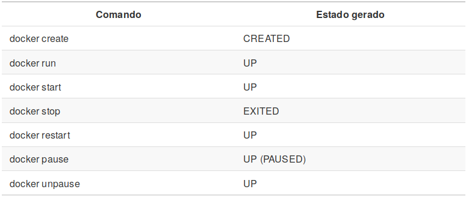
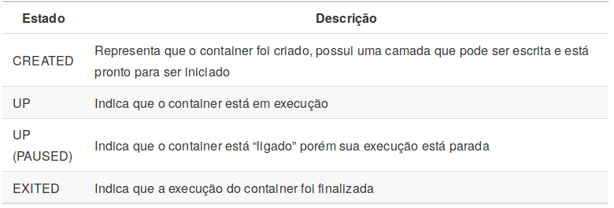
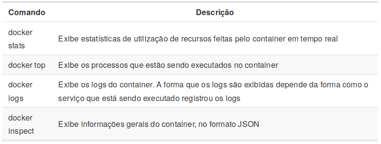
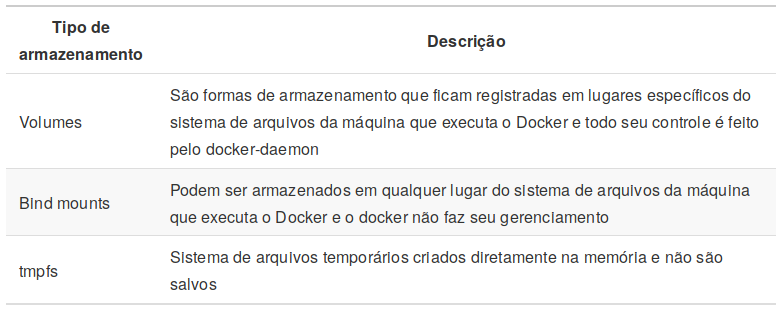

exclude: true
<style type="text/css">
code.r{
  font-size: 16px;
}
pre {
  font-size: 16px !important;
}

</style>
```{r setup, include=FALSE}
options(htmltools.dir.version = FALSE)
```
---
class: bg-main1

# Agenda

--
### Introdução `r emo::ji("heavy_check_mark")`

--
### Virtualização `r emo::ji("heavy_check_mark")`

--
### Docker `r emo::ji("heavy_check_mark")`

--
### Exemplos de uso `r emo::ji("heavy_check_mark")`

---
class: middle bg-main1

<center>
# Introdução

---
class: middle bg-main1

<center>
# Virtualização

---
class: bg-main1

# Virtualização

<br>

### Virtualização é o processo de criar .yellow[ambientes virtuais isolados]. Existem duas formas de prover tais ambientes (Chung et al. 2016), sendo elas, as baseadas em .yellow[containers] ou hypervisors (Morabito, Kjällman, and Komu 2015).

---
class: bg-main1

# Virtualização - Hypervisor

<br>

<center>
<div class="imageContainer divWithWhiteBackground">
  
<div>

---
class: bg-main1

# Virtualização - Containers

<br>

<center>
<div class="imageContainer divWithWhiteBackground">
  

---
class: middle bg-main1

<center>
# Docker `r emo::ji("whale")`

---
class: bg-main1

# Docker `r emo::ji("whale")`

<br>

### Docker é uma plataforma para o gerenciamento de containers (Schommer 2014), que ajuda desenvolvedores e administradores de sistemas a desenvolver, distribuir, implantar e executar aplicações em ambientes isolados, sem problemas com dependências do ambiente ou configurações.

---
class: bg-main1

# Docker `r emo::ji("whale")` Estrutura

<br>

<center>
<div class="imageContainer">


---
class: bg-main1

# Docker `r emo::ji("whale")` Estrutura

<br>

<center>
<div class="divWithWhiteBackground">


---
class: bg-main1

# Docker `r emo::ji("whale")` Instalação (Ubuntu)

<br>

--
Baixando e instalando

```{shell}
$ curl -fsSL https://get.docker.com -o get-docker.sh
$ sudo sh get-docker.sh
```

--
Permitindo a utilização por usuários não-root

```{shell}
$ sudo usermod -aG docker seu-usuario
```

--
Verificando a instalação realizada

```{shell}
$ docker -v
```

.yellow[\# Docker version 18.09.7, build 2d0083d]

---
class: bg-main1

# Docker `r emo::ji("whale")` Containers

<br>

### Containers são .yellow[instâncias] de Imagens Docker que estão sendo executadas em ambientes isolados, sendo que, nestes ambientes há todos os recursos necessários para a execução dos processos os quais foram definidos para os containers.

---
class: bg-main1

# Docker `r emo::ji("whale")` Imagens

<br>

###  As imagens Docker representam arquivos executáveis que possuem todo o descritivo de arquivos e processos que devem ser feitos no momento em que são executadas para a geração de um container. Imagens são geradas através de .yellow[Dockerfiles].

---
class: bg-main1

# Docker `r emo::ji("whale")` Criando imagens

<br>

--
Gerando o script Python que será executado dentro do container

```{shell}
echo "print('Oi! Esta é minha primeira imagem Docker! E ela funciona!')" > ola.py
```

--
Criando o arquivo .yellow[Dockerfile]

```{Dockerfile}
FROM python:3
COPY ola.py ./

CMD [ "./ola.py" ]
ENTRYPOINT [ "python" ]
```

--
Criando a imagem

```{shell}
$ docker build -t "minha_primeira_imagem:1.0" . 
```

--
Gerando um container

```{shell}
$ docker run minha_primeira_imagem:1.0
```

---
class: bg-main1

# Docker `r emo::ji("whale")` Camadas de uma imagem

<br>

### O Docker trabalha utilizando um conceito de .yellow[camadas], onde cada modificação realizada por comandos do Dockerfile cria uma camada que não pode ser alterada, sendo possível alterar somente a última camada gerada.

<br><br>

```{Dockerfile}
FROM ubuntu

RUN apt update -y
RUN apt install vim -y

ENTRYPOINT [ "bash" ]
```

---
class: bg-main1

# Docker `r emo::ji("whale")` Camadas de uma imagem

<br>

<center>
<div class="divWithWhiteBackground">


---
class: bg-main1

# Docker `r emo::ji("whale")` Camadas de uma imagem

<br>

<center>
<div class="divWithWhiteBackground">


---
class: bg-main1

# Docker `r emo::ji("whale")` Camadas de uma imagem

<br>

```{Dockerfile}
FROM ubuntu

RUN apt update -y && apt install vim -y && apt clean

ENTRYPOINT [ "bash" ]
```

--
As camadas tendem a diminuir

<center>
<div class="divWithWhiteBackground">


---
class: bg-main1

# Docker `r emo::ji("whale")` Aquisição de imagens

<br><br>

--
Liste as imagens que estão em sua máquina

```{shell}
docker images
```

--
Vamos pedir a execução de uma imagem do CentOS 7 ao Docker
```{shell}
docker run centos:7
```

---
class: bg-main1

# Docker `r emo::ji("whale")` Aquisição de imagens

<br>

<center>
<div class="divWithWhiteBackground">


---
class: bg-main1

# Docker `r emo::ji("whale")` Arquitetura geral

<br>
<center>
<div class="imageContainerWithBigImage">


---
class: middle bg-main1

<center>
# Administrando containers


---
class: middle bg-main1

<center>
# Administrando containers - Criando containers

---
class: middle bg-main1

<center>
# Administrando containers - Execuções


---
class: bg-main1

# Administrando containers - Execuções (Comandos)

<br>

<center>


---
class: bg-main1

# Administrando containers - Execuções (Estados)

<br>

<center>


---
class: bg-main1

# Administrando containers - Visualização de status

<br>

<center>


---
class: bg-main1

# Administrando containers - Gerenciamento de memória e CPU

<br><br>

### Quando não é atribuido limites de recursos a um *container*, se necessário, ele pode consumir todos os recursos da máquina onde está sendo executado.

--
Criando um novo container

```{shell}
$ docker run -ti --name debian_de_teste debian
```

--
Inspecionando a quantidade de memória que pode ser consumida
```{shell}
$ docker inspect debian_de_teste | grep -i memory
```

.yellow[\#
"Memory": 0,
"KernelMemory": 0,
"MemoryReservation": 0,
"MemorySwap": 0,
"MemorySwappiness": null
]

---
class: bg-main1

# Administrando containers - Gerenciamento de memória e CPU

<br><br>

--
Excluíndo container sem limite de memória
```{shell}
# -f Para excluir mesmo se o container estiver com estado UP
$ docker rm -f debian_de_teste
```

--
Criando container com limite de 512 MB
```{shell}
$ docker run -ti --name debian_de_teste --memory 512m debian
```

--
Inspecionando novamente a quantidade de memória que pode ser consumida
```{shell}
$ docker inspect debian_de_teste | grep -i memory
```

.yellow[\#
"Memory": 536870912,
"KernelMemory": 0,
"MemoryReservation": 0,
"MemorySwap": -1,
"MemorySwappiness": null
]

---
class: bg-main1

# Administrando containers - Gerenciamento de memória e CPU

<br>

### A mudança de quantidade de memória pode ser feita em .yellow[containers] já criados

--
Atualizando a quantidade de memória
```{shell}
$ docker update --memory 256m debian_de_teste
```

--
Verificando novamente a quantidade que pode ser utilizada
```{shell}
$ docker inspect debian_de_teste | grep -i memory
```

.yellow[\#
"Memory": 268435456,
"KernelMemory": 0,
"MemoryReservation": 0,
"MemorySwap": -1,
"MemorySwappiness": null
]

---
class: bg-main1

# Administrando containers - Gerenciamento de memória e CPU

<br><br>

```{shell}
$ docker run -ti --name debian_1 --cpu-shares 1024 debian
$ docker run -ti --name debian_2 --cpu-shares 512 debian
$ docker run -ti --name debian_3 --cpu-shares 512 debian
```

--
O comando .yellow[update] também é aplicável aqui
```{shell}
$ docker update --cpu-shares 758 debian_2
```

---
class: bg-main1

# Administrando containers - Armazenamento

<br>

### Docker disponibiliza três formas diferentes de armazenamento dos dados que estão dentro de um .yellow[container].  

<br>

<center>


---
class: bg-main1

# Administrando containers - Armazenamento

<br>

<center>
<div class="divWithWhiteBackground">
  

---
class: bg-main1

# Administrando containers - Armazenamento

### O foco aqui será nos .yellow[Volumes] e .yellow[Bind Mounts]

--
Criando container com .yellow[Volume]

```{shell}
$ docker run -ti -v /volume --name ubuntu_com_volume ubuntu
```

--
Criando arquivo dentro do .yellow[volume] no container

```{shell}
$ cd /volume && > arquivo_qualquer.txt
```

--
Verificando onde está o .yellow[volume] criado

```{shell}
$ docker inspect -f {{.Mounts}} ubuntu_com_volume
```

---
class: bg-main1

# Administrando containers - Armazenamento

--
Excluindo o container gerado anteriormente

```{shell}
$ docker rm -f ubuntu_com_volume
```

--
Criando diretório que guarda os dados do container

```{shell}
$ mkdir /arquivos_containers
```

--
Criando novo container com .yellow[Bind mount]

```{shell}
$ docker run -ti -v /arquivos_containers:/volume --name ubuntu_com_volume ubuntu
```
